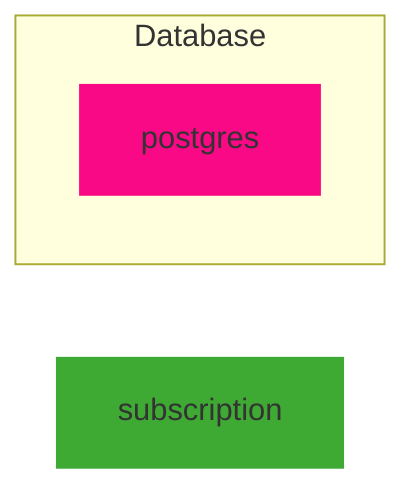
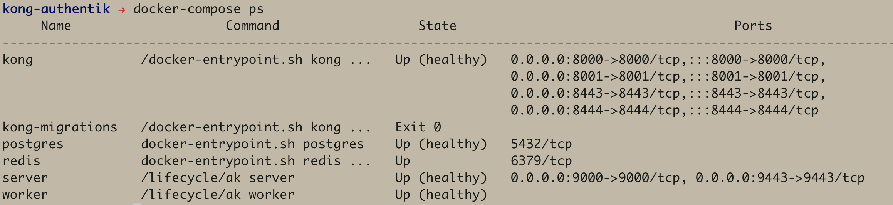
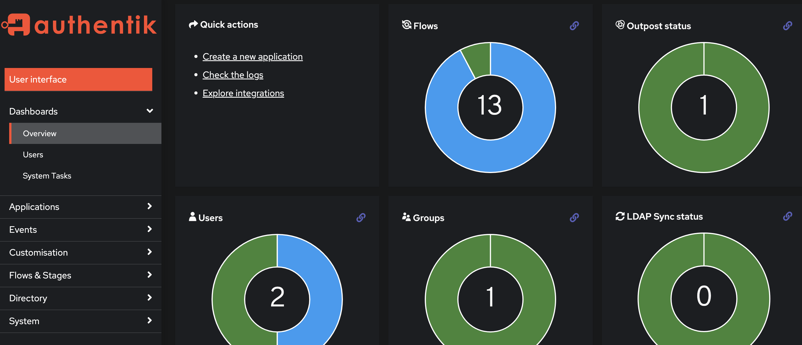
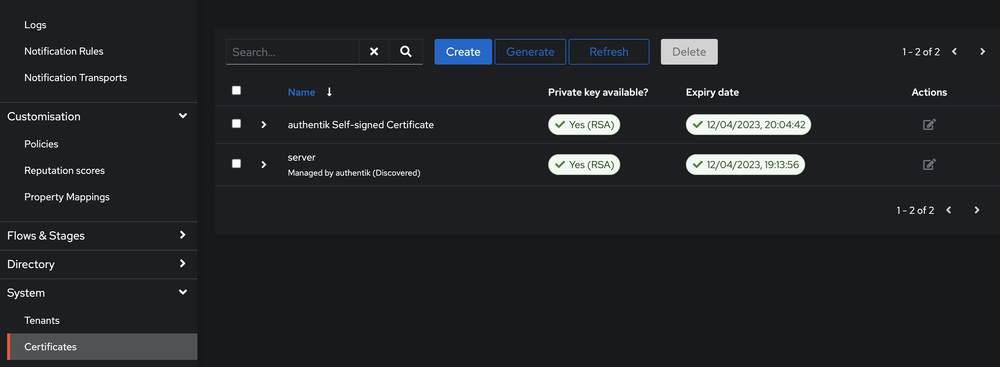

## Kong Api Gateway with Authentik IDP
This project runs through the setup process to route and protect APIs using Kong API gateway and the Authentik Identity provider.

The steps described here make use of open source offering from KongHQ and Authentik.

### Overview

We will make use of kong-oidc plugin from nokia to build kong image with oidc capability. We will also be generating keys of length 2048 to sign tokens at Authentik. There is an old dependency on lua-resty-openidc 1.6.1 which would not work with keys of length 4096.

We will use docker-compose to start all containers. Kong migration will run as soon as postgres container comes up. Kong depends on postgres. Authentik also saves data in postgres. 

Settings are provided in .env file.

We will use authentik UI to register the admin user and copy admin token. After that point, we will use API calls to set the rest. In the end, we will route to SpaceX APIs via our Kong Api gateway.

The following diagram shows the setup and the dependencies:




### Step 0: Create DNS entries
This is an optional step but it is nice to add host entries for each of the technologies in /etc/hosts file.

Mine looks like this

```
127.0.0.1   localhost
127.0.0.1   postgres server worker kong redis
```

Now you can reference these services with friendly names. Within the docker runtime, containers can use the same consistent friendly names to reference one another.

### Step 1: Create certificates
We will be using our own certificate for generating JWT tokens. 

Run the following command:

```
./ca.sh server
```
Default password is ```test123```

This will create a folder called "certs" under which there will be a random certificate authority folder as well as keys folder with server.pem and server.crt.

The certs/keys folder will be mounted to /certs folder in authentik container. Authentik can then be configured to use server.pem to sign tokens.

### Step 2: Startup containers
docker-compose is used to start containers here:

```
docker-compose up -d 
```

Things should startup properly but if you have any issue, re-run docker-compose up -d as it is idempotent operation for the purpose of this setup.

If all is well, you will see the following five containers in running state with kong-migrations with exit code of 0



Containers:
redis - authentik uses redis for cache and queue.
postgres - postgres which will serve as DB for authentik and kong.
kong - opensource version of kong api gateway
server - authentik server
worker - authentik worker


### Step 3: Configure 

Let's login to authentik server for the first time. 
The admin username for authentik is ```akadmin```.

Fire up http://server:9000/if/flow/initial-setup/ on your browser to set email and password for this account.

You will land on the dashboard but it is empty. Follow the link to Admin Interface ([http://server:9000/if/admin](http://server:9000/if/admin)) and you will be met with a nice admin dashboard.


We will try to do rest of the things with command line so let's collect whatever we can in this section. Head over to ```System >> Certificates```([http://server:9000/if/admin/#/crypto/certificates](http://server:9000/if/admin/#/crypto/certificates)) to view the available certificates.



Certificate from Step 1 should be one of the certificates in the list.

Also navigate to ```Directory >> Tokens & App passwords``` to view the token that is created for you at startup. At the right side of the screen is a small copy icon which can be clicked to copy the token value. Unless it is dev environment, keep it safely.


### References
|Description|Link|
|---|---|
| kong gateway docs | https://docs.konghq.com/gateway/2.8.x/install-and-run/docker/|
|kong oidc plugin | https://github.com/nokia/kong-oidc|
|authentik docs| https://goauthentik.io/docs/installation/|
|alternate idp |https://www.ory.sh/docs/welcome|
|alternate gateway|https://tyk.io/docs/apim/open-source/|
